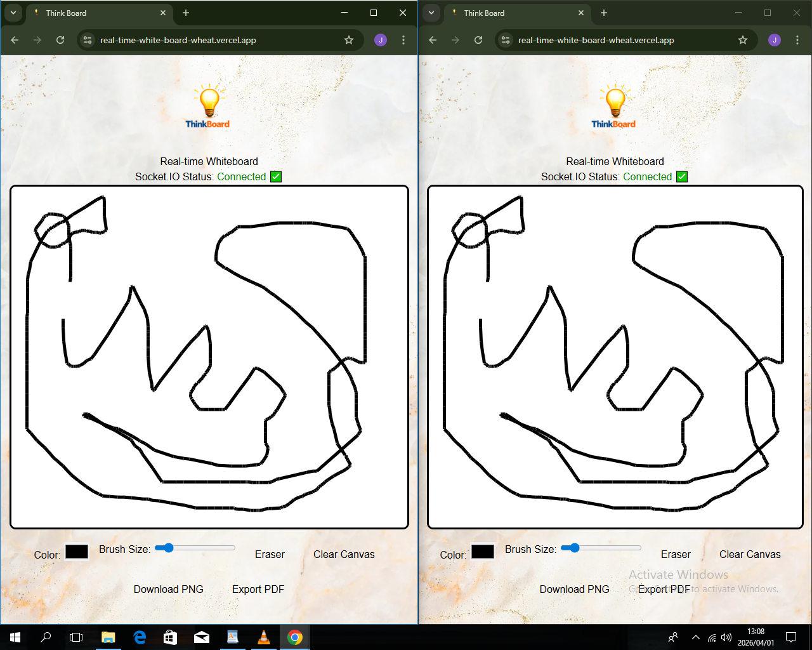
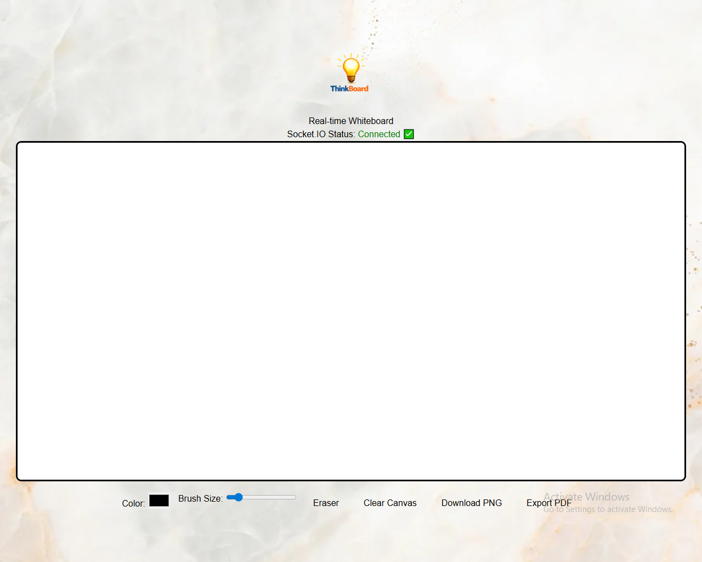

# 🎨 Real-Time Whiteboard

<p align="center">
  
</p>

<h3 align="center">
Real-Time Collaborative Drawing Application
</h3>

<p align="center">
Built with React, Node.js, Express, Socket.IO, and HTML5 Canvas.
</p>

<p align="center">
  <a href="https://real-time-white-board.vercel.app">
    
  </a>
  <a href="https://real-time-white-board-server.onrender.com">
    
  </a>
  
</p>

---

# 🚀 Live Demo

https://real-time-white-board-wheat.vercel.app

---

# 📖 Overview

Real-Time Whiteboard is a collaborative drawing platform that enables multiple users to draw on the same canvas simultaneously using persistent WebSocket connections.

Instead of relying on traditional request-response communication, the application uses **Socket.IO** to broadcast drawing events in real time, ensuring all connected clients remain synchronized with minimal latency.

This project was built to gain practical experience designing real-time systems, event-driven architectures, and production-ready deployment strategies.

---

# 🎯 Why I Built This

Modern collaborative applications like **Figma**, **Miro**, and **Google Jamboard** allow multiple users to interact with shared data instantly.

I wanted to understand the engineering principles behind these experiences by building a simplified collaborative system from scratch.

Through this project I explored:

- WebSocket communication
- Event-driven architecture
- Real-time state synchronization
- Low-latency client communication
- Production deployment
- Infrastructure decisions

---

# ✨ Features

## 👥 Collaboration

- Multi-user collaborative drawing
- Instant canvas synchronization
- Shared drawing workspace
- Persistent WebSocket communication
- Low-latency event broadcasting

---

## 🎨 Drawing

- Freehand drawing
- Smooth brush rendering
- Responsive canvas
- Canvas clearing
- Mobile-friendly interface

---

## ⚙️ Engineering

- Socket.IO WebSocket communication
- HTML5 Canvas rendering
- Event-driven backend
- React frontend
- Environment variable configuration
- Production deployment
- Cross-origin communication (CORS)

---

# ⚡ Tech Stack

| Layer | Technology |
|--------|------------|
| Frontend | React.js |
| Backend | Node.js |
| Framework | Express.js |
| Real-Time | Socket.IO |
| Rendering | HTML5 Canvas |
| Frontend Hosting | Vercel |
| Backend Hosting | Render |
| Version Control | Git & GitHub |

---

# 📸 Application Preview

## 🖌️ Desktop




# 🏗️ System Architecture

```text
                    User A
                       │
                       ▼
               React Frontend
                       │
               Socket.IO Client
                       │
══════════════════════════════════════
        Persistent WebSocket
══════════════════════════════════════
                       │
               Express Server
                       │
                Socket.IO Server
                       │
             Broadcast Drawing Events
          ┌───────────┼───────────┐
          ▼           ▼           ▼
       User B      User C      User D
```

The server acts as the central event hub, broadcasting drawing events received from one client to every connected client, keeping the canvas synchronized in real time.

---

# 🔄 Application Flow

1. User draws on the HTML5 Canvas.
2. Drawing coordinates are emitted through Socket.IO.
3. Express receives the drawing event.
4. Socket.IO broadcasts the event to every connected client.
5. Each client renders the stroke instantly.
6. All connected users remain synchronized.

---

# ⚙️ Design Decisions

## Why WebSockets?

Traditional HTTP requires repeated requests to retrieve updates.

Using **WebSockets** enables persistent, bidirectional communication between clients and the server, reducing latency and making real-time collaboration possible.

---

## Why Socket.IO?

Socket.IO simplifies:

- Connection management
- Automatic reconnection
- Event-based communication
- Browser compatibility

making it an excellent choice for collaborative applications.

---

## Why Render instead of Vercel?

Initially both frontend and backend were deployed on **Vercel**.

While the React frontend worked perfectly, the backend relied on persistent WebSocket connections, which are not suited to Vercel's serverless execution model.

Migrating the backend to **Render** provided:

- Long-running server instances
- Stable WebSocket support
- Reliable Socket.IO communication

This deployment challenge strengthened my understanding of infrastructure decisions and selecting the appropriate hosting platform based on application requirements.

---

# 🧠 State Synchronization

Maintaining consistent state across connected clients is one of the biggest challenges in collaborative applications.

This project synchronizes drawing operations by broadcasting every drawing event through the server.

Current behavior:

- All active users remain synchronized.
- New users begin with a blank canvas.
- Canvas history is intentionally not persisted to keep the application lightweight.

Future versions will introduce persistent drawing sessions backed by a database.

---

# 🧪 Testing

The application was manually tested across multiple browsers and devices to verify:

- Multiple simultaneous users
- Real-time synchronization
- WebSocket reconnection
- Cross-device responsiveness
- CORS configuration
- Production deployment

---

# 🎓 Skills Demonstrated

- React Development
- Node.js
- Express.js
- Socket.IO
- WebSocket Programming
- Event-Driven Architecture
- State Synchronization
- HTML5 Canvas
- Production Deployment
- Environment Configuration
- Infrastructure Decisions
- Real-Time Systems
- Problem Solving

---

# 📂 Project Structure

```text
Real-time-white-board
│
├── frontend/          React application
│
├── backend/           Express + Socket.IO server
│
├── assets/            Images and documentation
│
└── README.md
```

---

# ⚙️ Installation

## Clone Repository

```bash
git clone https://github.com/coffee-driven-dev007/Real-time-white-board.git
```

## Navigate into the project

```bash
cd Real-time-white-board
```

## Install Frontend

```bash
cd frontend
npm install
```

## Install Backend

```bash
cd ../backend
npm install
```

---

# 🔐 Environment Variables

## Backend

```env
PORT=5000

CLIENT_URL=http://localhost:5173
```

## Frontend

```env
VITE_SOCKET_URL=http://localhost:5000
```

---

# ▶️ Running Locally

## Backend

```bash
cd backend
npm run dev
```

## Frontend

```bash
cd frontend
npm run dev
```

---

# 🚧 Engineering Challenges

## Real-Time Synchronization

Designed an event-driven communication model that broadcasts drawing events to all connected clients while maintaining low latency.

---

## Canvas Rendering

Implemented efficient HTML5 Canvas rendering for smooth freehand drawing without excessive re-rendering.

---

## Deployment

One of the biggest engineering challenges was deploying persistent WebSocket connections.

Attempting to host both frontend and backend on Vercel exposed the limitations of serverless infrastructure for long-lived Socket.IO connections.

Migrating the backend to Render solved the issue and provided valuable hands-on experience with:

- WebSocket infrastructure
- Serverless limitations
- Environment variables
- CORS configuration
- Production networking
- Hosting architecture decisions

---

# 📚 Key Takeaways

Building this application provided practical experience with:

- Real-Time Application Development
- Event-Driven Systems
- WebSocket Communication
- Production Deployment
- Infrastructure Planning
- React Architecture
- Backend API Development
- State Synchronization
- Software Engineering Best Practices

---

# 🚀 Future Improvements

## High Priority

- User Authentication
- Private Collaboration Rooms
- Session Persistence
- Canvas History

## Medium Priority

- Cursor Presence Indicators
- Undo / Redo
- Shape Tools
- Text Tool

## Nice to Have

- Image Uploads
- PDF Export
- PNG Export
- Collaborative Comments

---

# 👨‍💻 Author

## James Matsheni

Full-Stack Developer passionate about building scalable backend systems, real-time applications, and production-ready software.

**GitHub**

https://github.com/coffee-driven-dev007

**Portfolio**

https://portfolio-beta-drab-76.vercel.app

---

# ⭐ Support

If you found this project interesting or useful, consider giving it a ⭐ on GitHub.

It helps support future development and makes the repository more visible to others.

---

# 📄 License

This project is licensed under the MIT License.

---

<p align="center">

Built with ❤️ by <strong>James Matsheni</strong>

Building reliable, real-time systems with modern JavaScript technologies.

</p>
